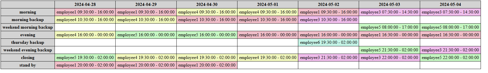

# Employees Shift Schedule

This service is the core **scheduling engine** of the Keep On Time Shifts project.  
It uses **Google OR-Tools** and **FastAPI** to generate optimal employee shift schedules based on preferences, availability, and constraints.


---

## 🚀 Tech Stack

- **Python 3.11+**
- **FastAPI** – lightweight web API
- **Google OR-Tools** – constraint programming
- **Pydantic** – data validation
- **Uvicorn** – ASGI server

---

## Role in the Architecture

This Python service handles **shift optimization logic**.  
It is packaged as a C# Nuget (nupkg), which is accessed through the C# API Gateway,  which forwards employee availability data and returns scheduled results to the frontend.

---

## ✨ Features
- **Employee Preferences**: Aiming to satisfy and consider each employee's preferred and undesired shifts.
- **Shift Type Training**: Ensures employees are only assigned to shifts they are trained for,  
to ensure operational efficiency.
- **Fair Distribution of Shifts**: Distributes shifts to employees,  
according to their employment status (part-time or full-time) and priority.
- **Rest Periods**: Enforces rest periods between shifts to meet labor regulations,  
and promote employee well-being.

---

## 🛠 Using This Service as a Standalone Python Script to Generate Shift Schedules

To generate shift schedules using this Python service, you'll need:

- A list of `Shift` objects representing the week's schedule
- A list of `Employee` objects with their preferences

### 👤 Creating Employees with Preferences
```python 
emp_shifts_wants_to_work = ShiftIdPreference(["sunday_morning"]) # str shift ID for simple example,
emp_shifts_prefer_not_to_work = DateTimeRangePreference(now(), 
                                                        now() + timedelta(hours=random.Random()))

emp_preferences = EmployeesShiftsPreferences(shifts_wants_to_work=emp_shifts_wants_to_work, 
                                             shifts_prefer_not_to_work=emp_shifts_prefer_not_to_work)

emp = Employee(shifts_preferences=emp_preferences, 
               shift_types_trained_to_do=[ShiftTypesEnum.EVENING, ShiftTypesEnum.MORNING])
```
### 🕒 Creating Shifts
```python
shift_start_time = now()
shift_end_time = shift_start_time + timedelta(hours=random.Random())

shift = Shift(shift_id=uuid.uuid4(), shift_type=ShiftTypesEnum.MORNING, 
              start_time=shift_start_time, end_time=shift_end_time)
```
### 🧩 Generating the Schedule
Once you have your list of employees and shifts, you can generate the schedule:
```python
schedule_solution = create_solutions([emp], [shift]) 
```
This can yield one or more schedules, which you can use as needed.
```python
# Yielding 5 schedules
schedules_options = []
for i in itertools.islice(schedule_solution.yield_schedules(), 5):
    schedules_options.append(i)
```

### 🎨 Visual Output
For better visibility, you can use the included main.py to:

- Read shift and employee data from files (just replace the files location)
- Generate an HTML file that visually displays the schedule



---

## ⚙️ Installation

```bash
# Clone the repo
git clone https://github.com/noadudai/EmployeeShiftsSchedule
cd EmployeeShiftsSchedule

# Install dependencies
pip install -r requirements.tx
```

---

## GitHub Actions
This project uses GitHub Actions to automate the process of :
- Generate the OpenAPI spec 
- Create the C# client and publish the NuGet library.

The CI workflow ensures the system is always up-to-date with the latest scheduling logic.  
Check out the workflow configuration in the ``` .github/workflows ``` directory for more details.

---

## 👤 About the Author

*Noa Dudai*  
Full Stack Developer & Backend Engineer  
Based in Israel 🇮🇱

### 🌐 Connect with me

<a href="https://github.com/noadudai" target="_blank">
  
</a>
&nbsp;&nbsp;
<a href="https://www.linkedin.com/in/noadudai" target="_blank">
  
</a>